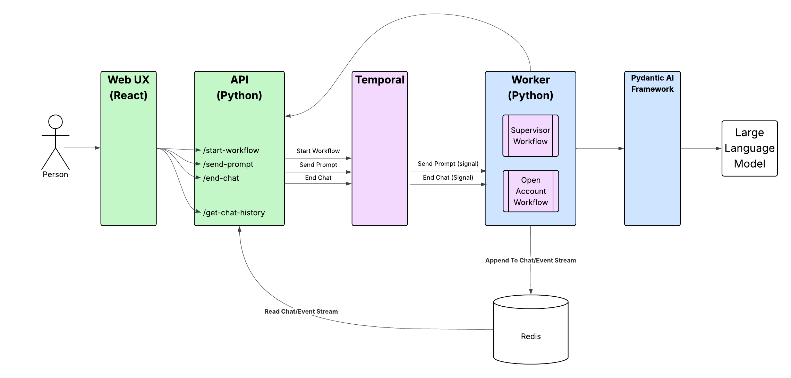
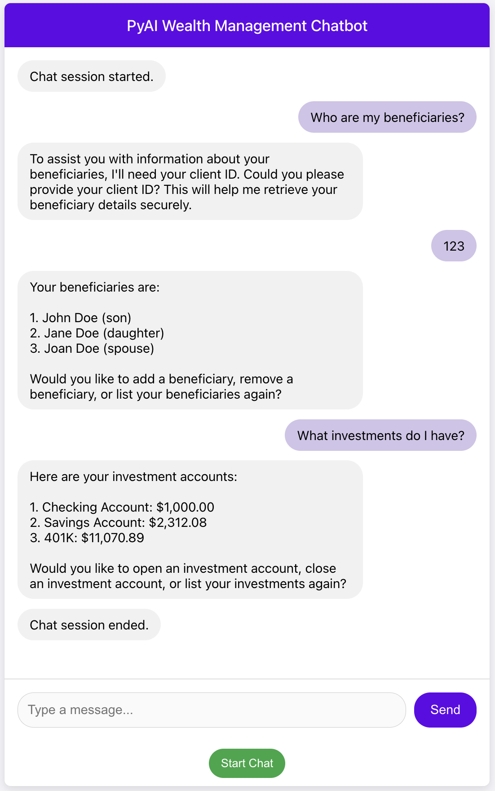
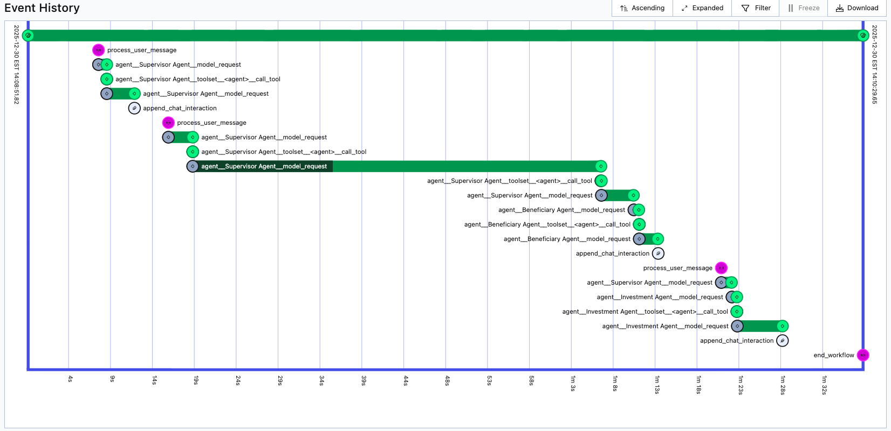

# Wealth Management Multi-Agent Example using Pydantic AI Framework 

Demonstrates how to use the Pydantic AI Framework with Temporal. It shows how to coordinate between multiple agents that deal with specific domains of expertise.

The supervisor agent is responsible for directing the actions to the appropriate
helper agents.

Scenarios currently implmeneted include
* Add Beneficiary - add a new beneficiary to your account
* List Beneficiaries - shows a list of beneficiaries and their relationship to the account owner
* Delete Beneficiary - delete a beneficiary from your account
* Open Investment Account - opens a new investment account 
* List Investments - shows a list of accounts and their current balances
* Close Investment Account - closes an investment account

## Application Architecture
The overall application architecture looks like this:



There is a React UX which is where the customer interacts with the application. 
The React UX leverages an API which exposes endpoints to start a workflow, send a prompt,
retrieving the chat history, and ending the chat. The React frontend uses adaptive polling
to retrieve new events from Redis. 

The API in turn, communicates with Temporal to start workflows and send signals. Finally, 
the worker contains the supervisor workflow which contain the agents and business logic 
that drive the agentic application.

## Prerequisites
* [uv](https://docs.astral.sh/uv/) - Python package and project manager
* [OpenAI API Key] (https://platform.openai.com/api-keys) - Your key to accessing OpenAI's LLM
* [Temporal CLI](https://docs.temporal.io/cli#install) - Local Temporal service
* [Redis](https://redis.io/downloads/) - Stores conversation history

# Set up Python Environment
```bash
uv sync
```

## Set up your OpenAI API Key
 
```bash
cp setoaikey.example setoaikey.sh
chmod +x setoaikey.sh
```

Now edit the setoaikey.sh file and paste in your OpenAI API Key.
It should look something like this:
```bash
export OPENAI_API_KEY=sk-proj-....
```
## Set up Redis

Redis is used for storing conversation history. If you don't have an existing Redis server, you can run one locally after installing it. 

In a new terminal / shell run the following command:

```bash
redis-server
```

By default, the application expects to find Redis running locally. You can override the location of Redis
by setting the environment variables:

```bash
export REDIS_HOST=localhost
export REDIS_PORT=6379
```

In a terminal, run the Temporal Server locally.

## Running the Demo Locally
Start Temporal Locally.

```bash
temporal server start-dev
```

In another terminal, start the worker.

### Start the Worker

```bash
cd src/temporal_supervisor
./startlocalworker.sh
```

In another terminal, start the REST API.

### Start the API

```bash
cd src/temporal_supervisor/api
./startlocalapi.sh
```

And in another terminal, start the UX. 

### Start the UX
```bash
cd src/temporal_supervisor/frontend
npm start
```

A new browser window opens where you can interact with the application. 

Here is a screenshot of the UX walking through a few scenarios:



Here is a sample event history shown in the Temporal UX



### Running from the command line

Alternatively you can interact with workflow using the temporal CLI 

Start the worker in a new terminal:

```bash
./startlocalworker.sh
```

And in another terminal you can run the following commands:

```bash
# starts a workflow execution
temporal workflow start --workflow-id ai-chat --type WealthManagementWorkflow --task-queue PY-AI-Supervisor 

# send it a request using a signal
temporal workflow signal --workflow-id ai-chat --name process_user_message --input '{"user_input":"Who are my beneficiaries?"}'

# retrieve the chat history directly from the workflow execution
temporal workflow query --workflow-id ai-chat --type get_chat_history

# send it the client id via a signal
temporal workflow signal --workflow-id ai-chat --name process_user_message --input '{"user_input":"123"}'

# ask about investments via a signal 
temporal workflow signal --workflow-id ai-chat --name process_user_message --input '{"user_input":"what investments do I have?"}'

# ends the workflow execution
temporal workflow signal --workflow-id ai-chat --name end_workflow
```

## Running the Demo in Temporal Cloud

Copy the setcloudenv.example, located in the src/temporal_supervisor folder to the project root and name it setcloudenv.sh .

```bash
cp  src/temporal_supervisor/setcloudenv.example setcloudenv.sh
```

Edit setcloudenv.sh to match your Temporal Cloud account:
```bash
export TEMPORAL_ADDRESS=<namespace>.<accountID>.tmprl.cloud:7233
export TEMPORAL_NAMESPACE=<namespace>.<accountID>
export TEMPORAL_TLS_CLIENT_CERT_PATH="/path/to/cert.pem"
export TEMPORAL_TLS_CLIENT_KEY_PATH="/path/to/key.key"
```

### Start the Worker

In a terminal, start the worker, using Temporal Cloud:

```bash
cd src/temporal_supervisor
./startcloudworker.sh
```

### Start the API

In another terminal, start the API using Temporal Cloud

```bash
cd src/api
./startcloudapi.sh
```

And in another terminal, start the UX:

### Start the UX
```bash
cd src/frontend
npm start
```

A new browser window opens where you can interact with the application. 